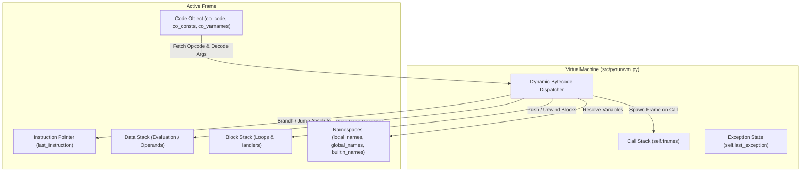
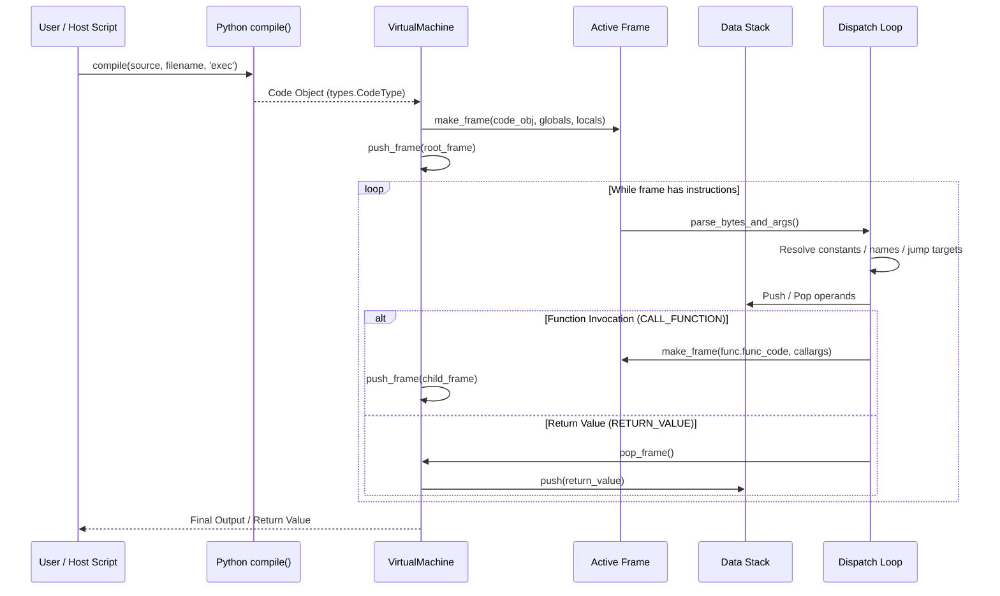

# PyRun ⚡

> A lightweight, stack-based Python bytecode virtual machine and interpreter written in pure Python. Simulates CPython's runtime engine—complete with evaluation data stack, call frames, block unwinding, dynamic opcode dispatch, and Dockerized one-command execution.


-brightgreen?style=flat-square)
-success?style=flat-square)


**PyRun** is a pure-Python implementation of a Python bytecode virtual machine. It takes compiled Python code objects (`types.CodeType`) and executes them by simulating the lower-level mechanics of CPython: managing call frames, operand evaluation on an internal data stack, control flow via an instruction pointer and block stack, and runtime dispatch across dozens of Python 3.5 opcodes.

---

## 🚀 Key Features

- **Stack-Based Execution Engine:** Simulates CPython's evaluation stack for expression evaluation, mathematical operations, local assignment, and function arguments.
- **Full Call Frame Lifecycle:** Implements call stack frames with isolated local scopes, global namespace sharing, and builtin fallback resolution.
- **Structured Block Stack Management:** Tracks loop and exception blocks with stack height bookmarks, enabling clean stack unwinding during `break`, `continue`, and exception propagation.
- **Comprehensive Operator Support:**
  - Standard binary arithmetic (`+`, `-`, `*`, `/`, `//`, `%`, `**`, bitwise shifts, and logical bitwise operations).
  - Unary operators (`+`, `-`, `~`, `not`).
  - Full suite of **in-place mutating operators** (`+=`, `-=`, `*=`, `/=`, `//=`, `%=`, `**=`, `<<=`, `>>=`, `&=`, `|=`, `^=`).
- **Complete Control Flow & Jumps:** Supports conditional branching (`if`/`elif`/`else`) and loops (`for`, `while`) with both relative and absolute jump resolution.
- **First-Class Functions:** Emulates user-defined Python functions, parameter binding via `inspect.getcallargs`, default argument tuples, and recursion.
- **Python 3.5 Data Structures:** Native creation, indexing, and mutation of lists, tuples, sets, and dictionaries (`BUILD_MAP`, `STORE_SUBSCR`, `LIST_APPEND`, `SET_ADD`).
- **One-Command Docker Setup:** Fully containerized with Docker and Docker Compose for instant, reproducible execution without installing Python 3.5 locally.

---

## 🛠️ Supported Bytecodes & Tech Stack

### Core VM Specification
| Component | Specification | Purpose |
|---|---|---|
| **Runtime Language** | Pure Python | Zero third-party dependencies; uses standard library (`dis`, `inspect`, `types`, `operator`) |
| **Bytecode Target** | Python 3.5 (`co_code`) | Variable-length instruction decoding (1-byte opcode / 3-byte operand format) |
| **Execution Model** | Stack Machine | Last-In-First-Out (LIFO) operand stack with frame call stack |
| **Environment** | Docker / Docker Compose | Isolated `python:3.5-slim` container with live volume mounting |

### Supported Bytecode Categories
| Category | Supported Opcodes | Description |
|---|---|---|
| **Stack Ops** | `LOAD_CONST`, `POP_TOP`, `DUP_TOP`, `DUP_TOP_TWO`, `ROT_TWO`, `ROT_THREE`, `ROT_FOUR` | Stack manipulation and value duplication |
| **Name Resolution** | `LOAD_NAME`, `STORE_NAME`, `DELETE_NAME`, `LOAD_FAST`, `STORE_FAST`, `DELETE_FAST`, `LOAD_GLOBAL`, `STORE_GLOBAL`, `LOAD_LOCALS` | Local, global, fast, and builtin namespace management |
| **Arithmetic & Bitwise** | `BINARY_ADD`, `SUBTRACT`, `MULTIPLY`, `TRUE_DIVIDE`, `FLOOR_DIVIDE`, `MODULO`, `POWER`, `LSHIFT`, `RSHIFT`, `AND`, `OR`, `XOR` | Mathematical and bitwise computations |
| **In-Place Operators** | `INPLACE_ADD`, `SUBTRACT`, `MULTIPLY`, `TRUE_DIVIDE`, `FLOOR_DIVIDE`, `MODULO`, `POWER`, `LSHIFT`, `RSHIFT`, `AND`, `OR`, `XOR` | In-place mutations (`+=`, `-=`, `*=`, etc.) |
| **Unary Ops** | `UNARY_POSITIVE`, `UNARY_NEGATIVE`, `UNARY_NOT`, `UNARY_INVERT` | Unary negation, identity, logical not, bitwise invert |
| **Comparisons** | `COMPARE_OP` | `<`, `<=`, `==`, `!=`, `>`, `>=`, `in`, `not in`, `is`, `is not`, exception matching |
| **Control Flow** | `POP_JUMP_IF_TRUE`, `POP_JUMP_IF_FALSE`, `JUMP_IF_TRUE_OR_POP`, `JUMP_IF_FALSE_OR_POP`, `JUMP_FORWARD`, `JUMP_ABSOLUTE` | Branching, conditional jumping, short-circuit evaluation |
| **Loop Blocks** | `SETUP_LOOP`, `GET_ITER`, `FOR_ITER`, `POP_BLOCK`, `BREAK_LOOP`, `CONTINUE_LOOP` | Iterators, loop setup, early breaks, and stack unwinding |
| **Collections** | `BUILD_LIST`, `BUILD_TUPLE`, `BUILD_SET`, `BUILD_MAP`, `STORE_MAP`, `LIST_APPEND`, `SET_ADD`, `MAP_ADD`, `UNPACK_SEQUENCE` | Lists, tuples, sets, and dictionaries |
| **Subscript & Attributes** | `BINARY_SUBSCR`, `STORE_SUBSCR`, `DELETE_SUBSCR`, `LOAD_ATTR`, `STORE_ATTR`, `DELETE_ATTR` | Object attribute access and container indexing |
| **Functions** | `MAKE_FUNCTION`, `CALL_FUNCTION`, `RETURN_VALUE` | Function construction, argument unpacking, and return handling |

---

## 🏗️ System & VM Architecture



### Visualizing the VM Runtime Model

```
+-------------------------------------------------------------------+
|                          VirtualMachine                           |
|                                                                   |
|   +-----------------------------------------------------------+   |
|   |                  Call Stack (self.frames)                 |   |
|   |                                                           |   |
|   |   +---------------------------------------------------+   |   |
|   |   |                   Frame (Active)                  |   |   |
|   |   |                                                   |   |   |
|   |   |   - code_obj (co_code, co_consts, co_varnames)    |   |   |
|   |   |   - global_names / local_names / builtin_names    |   |   |
|   |   |   - last_instruction (instruction pointer)        |   |   |
|   |   |                                                   |   |   |
|   |   |   +-------------------+   +-------------------+   |   |   |
|   |   |   |    Data Stack     |   |    Block Stack    |   |   |   |
|   |   |   | (value evaluation)|   | (loops & excepts) |   |   |   |
|   |   |   +-------------------+   +-------------------+   |   |   |
|   |   +---------------------------------------------------+   |   |
|   |                                                           |   |
|   +-----------------------------------------------------------+   |
+-------------------------------------------------------------------+
```

---

## 🧠 Bytecode Execution Pipeline



---

## 🚦 Quick Start & Docker Usage

Because PyRun targets Python 3.5's bytecode layout, **Docker and Docker Compose** are the recommended way to run this project. You do not need Python 3.5 installed on your host machine.

### Prerequisites
- [Docker Desktop](https://www.docker.com/products/docker-desktop/) (Windows / macOS) or Docker Engine + Docker Compose (Linux).

---

### Method 1: Docker Compose (Recommended)

#### 1. Run the Entire Test Suite
Builds the image and runs all 6 test suites automatically:
```bash
docker compose up --build
```

#### 2. Run a Specific Test or Script
Execute any test file or external Python script through PyRun inside the container:
```bash
# Run comprehensive integration tests
docker compose run --rm pyrun python src/pyrun/run.py tests/test_comprehensive.py

# Run arithmetic and in-place operator tests
docker compose run --rm pyrun python src/pyrun/run.py tests/test_arithmetic.py
```

#### 3. Live Development (Instant Code Reloading)
The `docker-compose.yml` mounts your local directory directly into `/app`:
```yaml
volumes:
  - .:/app
```
**You do not need to rebuild the Docker image when editing code!** Any changes you make to `src/pyrun/vm.py` or `tests/` on your host are immediately reflected inside the container. Simply re-run:
```bash
docker compose run --rm pyrun python tests/run_all_tests.py
```

#### 4. Interactive Container Shell
Open an interactive bash shell in the Python 3.5 environment:
```bash
docker compose run --rm pyrun bash
```

---

### Method 2: Plain Docker CLI

If you prefer using Docker directly without Compose:

```bash
# 1. Build the image
docker build -t pyrun .

# 2. Run all tests
docker run --rm -it pyrun

# 3. Run with live volume mounting
docker run --rm -it -v "$(pwd):/app" pyrun python tests/run_all_tests.py

# 4. Run a specific file
docker run --rm -it -v "$(pwd):/app" pyrun python src/pyrun/run.py tests/test_comprehensive.py
```

---

### Method 3: Native Execution (If Python 3.5 is Installed)

If you already have Python 3.5 installed locally on your machine:

```bash
# Run the automated test runner
python tests/run_all_tests.py

# Or run individual test suites
python src/pyrun/run.py tests/test_arithmetic.py
python src/pyrun/run.py tests/test_control_flow.py
python src/pyrun/run.py tests/test_loops.py
python src/pyrun/run.py tests/test_functions.py
python src/pyrun/run.py tests/test_data_structures.py
python src/pyrun/run.py tests/test_comprehensive.py
```

---

## 🧪 Test Suite & Verification

The test suite thoroughly exercises the virtual machine across arithmetic, control flow, loops, functions, and composite algorithms:

| Test Suite | File | What is Tested |
|---|---|---|
| **Arithmetic & Operators** | `tests/test_arithmetic.py` | Binary ops (`+`, `-`, `*`, `/`, `//`, `%`, `**`), bitwise (`<<`, `>>`, `&`, `\|`, `^`), unary (`~`, `not`), and all in-place operators (`+=`, `-=`, etc.) |
| **Control Flow** | `tests/test_control_flow.py` | Comparison ops (`<`, `<=`, `==`, `!=`, `>`, `>=`), membership (`in`), identity (`is`), multi-way `if`/`elif`/`else` jumping |
| **Loops & Iteration** | `tests/test_loops.py` | `for` loops with `range()`, step increments, string/list iteration, nested loops, early `break` and stack unwinding |
| **Functions** | `tests/test_functions.py` | User function definitions, positional arguments, default argument values, recursion, and nested calls |
| **Data Structures** | `tests/test_data_structures.py` | Lists (`append`, indexing `[-1]`), dictionaries (`BUILD_MAP`), attribute lookup (`str.upper()`, `str.startswith()`) |
| **Comprehensive Integration** | `tests/test_comprehensive.py` | End-to-end algorithms: **Bubble Sort**, **Prime Sieve**, **Collatz Conjecture Steps**, and **Bitmask Accumulation** |

---

## 📂 Project Directory Structure

```
PyRun/
├── Dockerfile                  # Container definition using official python:3.5-slim
├── docker-compose.yml          # Live volume mounting & container configuration
├── .dockerignore               # Clean build context exclusion rules
├── pyproject.toml              # Project metadata and packaging config
├── README.md                   # Comprehensive documentation & architecture guide
├── src/
│   └── pyrun/
│       ├── __init__.py         # Package entry point
│       ├── vm.py               # Core Virtual Machine, Frame, and Function engine
│       ├── run.py              # CLI driver to compile and run any Python file
│       └── legacy.py           # Pedagogical minimal stack interpreter
└── tests/
    ├── run_all_tests.py        # Automated runner executing all test suites
    ├── test_arithmetic.py      # Binary, unary, bitwise, and in-place tests
    ├── test_control_flow.py    # Conditional branching and comparison tests
    ├── test_loops.py           # For loops, step ranges, and break tests
    ├── test_functions.py       # Function calls, parameters, and defaults
    ├── test_data_structures.py # Lists, dicts, indexing, and attributes
    └── test_comprehensive.py   # Full integration test (Bubble Sort, Primes, Collatz)
```

---

## 💻 Programmatic Usage

You can import and embed PyRun directly in your own Python programs:

```python
from vm import VirtualMachine

# Source code to run inside the VM
source = """
def bubble_sort(arr):
    n = len(arr)
    for i in range(n):
        for j in range(0, n - i - 1):
            if arr[j] > arr[j + 1]:
                temp = arr[j]
                arr[j] = arr[j + 1]
                arr[j + 1] = temp
    return arr

numbers = [64, 34, 25, 12, 22, 11, 90]
print("Sorted output:", bubble_sort(numbers))
"""

# Compile into a Python code object
code_obj = compile(source, "<string>", "exec")

# Initialize and execute inside the PyRun virtual machine
vm = VirtualMachine()
vm.run_code(code_obj)
```

---

## 🎓 Engineering Decisions & What I Learned

Building PyRun provided deep, hands-on insights into compiler internals, virtual machine design, and CPython's execution model:

- **Stack-Based Architecture vs. Register Machines:** Unlike register machines (such as LuaJIT or Dalvik) that explicitly name registers in instructions, stack machines operate on an implicit LIFO evaluation stack (`LOAD_FAST`, `BINARY_ADD`, `STORE_FAST`). This simplifies the bytecode compiler and reduces opcode payload sizes while requiring careful stack height tracking during control flow changes.
- **Dynamic Bytecode Decoding in Python 3.5:** In Python 3.5, bytecode instructions without arguments occupy **1 byte**, while instructions with arguments (`>= dis.HAVE_ARGUMENT`) occupy **3 bytes** (1 byte opcode + 2-byte little-endian operand: `arg[0] + (arg[1] * 256)`). Understanding this variable-length encoding is crucial for correctly advancing the instruction pointer (`last_instruction`).
- **Relative vs. Absolute Jump Addressing:**
  - Instructions in `dis.hasjrel` (like `JUMP_FORWARD` and `SETUP_LOOP`) specify a relative delta from the next instruction. PyRun resolves these into absolute target byte offsets (`f.last_instruction + arg_val`).
  - Instructions in `dis.hasjabs` (like `POP_JUMP_IF_FALSE` and `POP_JUMP_IF_TRUE`) directly supply an absolute target address.
  - Crucially, all jump executions in the VM must perform absolute pointer assignment (`jump_absolute`) rather than relative pointer increments (`+= jump`), preventing the instruction pointer from overshooting the bytecode array.
- **Block Stack Unwinding for Structured Control Flow:** Handling `break`, `continue`, and exceptions requires more than just jumping to a target instruction. When a loop or `try` block begins, a `Block` entry records the data stack height at entry. When a loop exits via `break`, the block stack unwinds the data stack back to that baseline, purging temporary loop variables and preventing data stack leaks.
- **In-Place Mutation vs. Binary Operators:** Binary operators (`BINARY_ADD`) leave original objects untouched and push a new result. In-place operators (`INPLACE_ADD`), however, invoke `__iadd__` to mutate mutable objects (like lists or custom objects) in place, falling back to standard binary operators for immutable primitives (integers, strings).
- **Python 3.5 Dictionary Compilation (`BUILD_MAP`):** In Python 2, dictionaries were initialized empty and populated sequentially with `STORE_MAP`. In Python 3.5, dictionary displays evaluate all keys and values first, pushing pairs onto the stack, and then issue `BUILD_MAP <count>`, which pops `2 * count` elements simultaneously. Reversing or miscounting these values results in inverted key-value mappings and `KeyError` exceptions.
- **Function Frames and Argument Binding:** User functions in Python cannot share the caller's frame. Each invocation creates a fresh `Frame` with its own isolated `local_names` dictionary. Utilizing `inspect.getcallargs` guarantees that positional arguments, default values, and keyword mappings conform precisely to standard Python behavior before the child frame executes.

---

## 🛡️ License

This project is licensed under the [MIT License](LICENSE).
